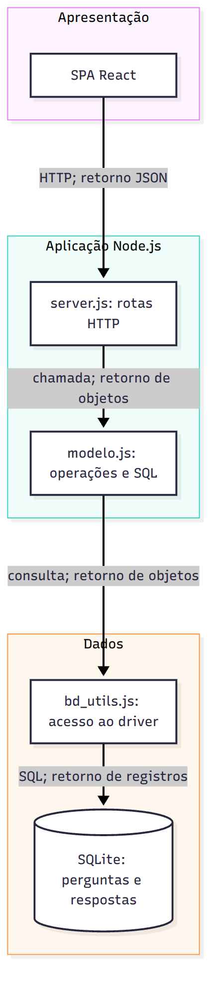

# Arquitetura atual do ESM Forum

## Estilos

O sistema tem arquitetura **cliente-servidor**, com SPA React separada de uma API Express. O backend é um monólito pequeno: rotas e persistência executam no mesmo processo Node, usando SQLite local. Há separação lógica em apresentação, aplicação e dados, mas a camada de negócio é pouco delimitada e não deve ser descrita como arquitetura limpa completa ou microsserviços.

## Componentes observados

| Componente | Responsabilidade e dependências |
|---|---|
| React: Pergunta, Resposta, Menu | Formulários, rotas de navegação, apresentação e chamadas fetch |
| server.js | Rotas GET/POST, conversão de parâmetros e respostas HTTP |
| modelo.js | Cadastro/consulta de perguntas e respostas; contém SQL e composição de resultados |
| bd/bd_utils.js | Traduz chamadas para better-sqlite3 |
| bd/esmforum.db | Persistência local em tabelas perguntas e respostas |

A interface envia HTTP para localhost:5000 e recebe JSON. POST envia corpo JSON. O middleware original configura CORS para permitir origens externas, adequado apenas como conveniência didática; não é mecanismo de autenticação. No frontend, BrowserRouter organiza as páginas.

## Fluxo existente

Ao abrir perguntas, React requisita a API; server.js chama modelo.listar_perguntas(); o modelo consulta o banco e calcula contagens; a API retorna um array JSON; React constrói a tabela. O código-base faz consultas adicionais por pergunta, conforme DESIGN_SIMPLES.md.

O diagrama retrata o snapshot original. Na versão entregue, a busca percorre controller → serviço → repositório SQLite, enquanto as rotas antigas continuam usando modelo.js. Isso é uma migração incremental, não uma refatoração integral já concluída.
