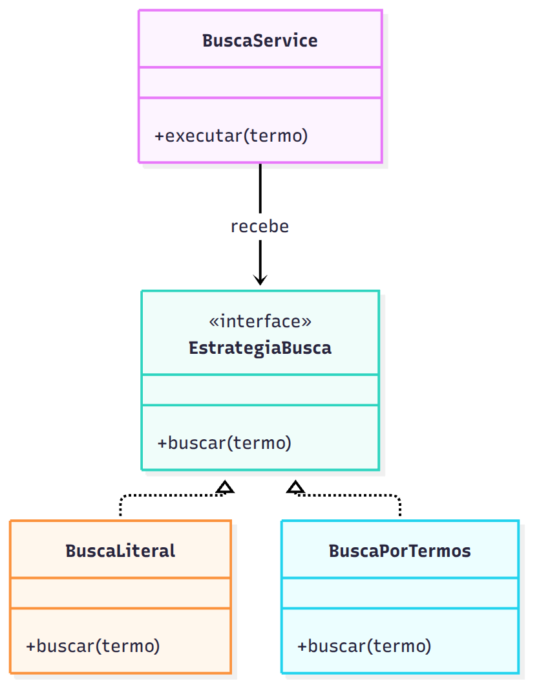
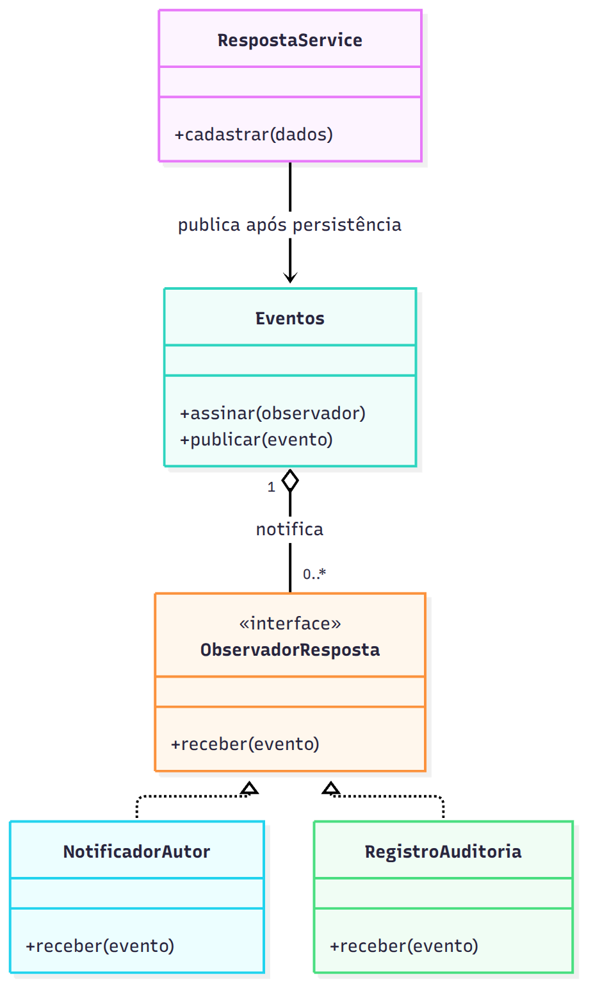
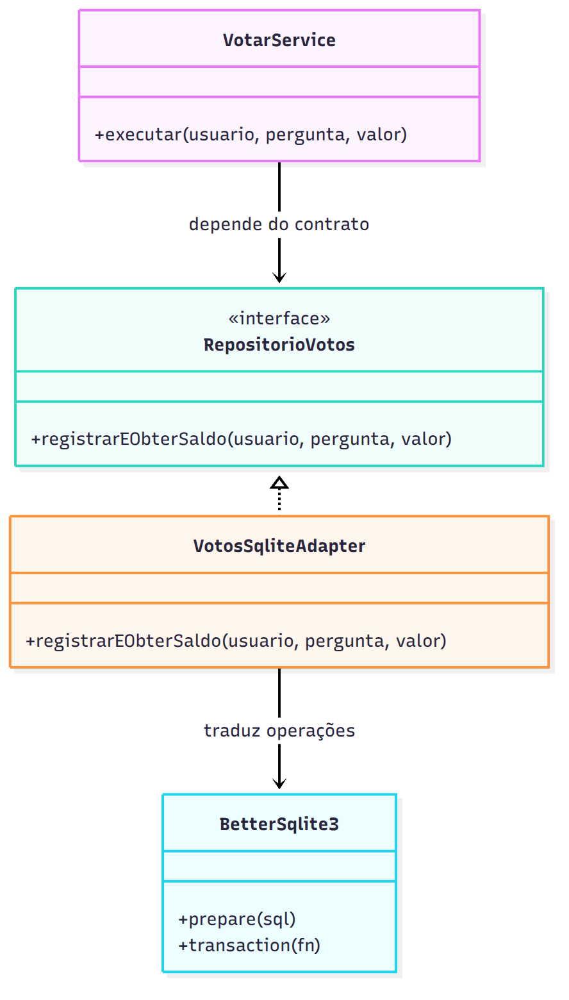

# Três propostas de padrões de projeto

As propostas abaixo são análises da Iteração 2. O pseudocódigo ilustra a estrutura; não representa funcionalidades já entregues. Fontes e imagens estão em diagramas/.

## 1. Strategy — critérios de busca

**Contexto e problema:** a busca atual usa substring literal. Se o fórum passar a oferecer busca literal e busca por termos, colocar condicionais em todas as rotas aumentará acoplamento. Strategy é adequado quando existem algoritmos intercambiáveis que cumprem o mesmo propósito.

**Estrutura:** `BuscaService` recebe uma `EstrategiaBusca`, que expõe `buscar(termo)`. `BuscaLiteral` e `BuscaPorTermos` implementam o contrato e usam repositórios. A composição escolhe uma estratégia permitida; o serviço não conhece suas classes. A estratégia por termos deverá definir se todos os termos são exigidos e manter parâmetros vinculados.

```js
class BuscaService {
  constructor(estrategia) { this.estrategia = estrategia; }
  executar(termo) { return this.estrategia.buscar(termo); }
}
class BuscaLiteral {
  constructor(repo) { this.repo = repo; }
  buscar(termo) { return this.repo.buscarLiteral(termo); }
}
class BuscaPorTermos {
  constructor(repo) { this.repo = repo; }
  buscar(termo) { return this.repo.buscarTodosOsTermos(termo.split(/\s+/)); }
}
```

**Benefício e custo:** permite testar algoritmos separadamente e ampliar os modos sem mudar o serviço. Custa classes adicionais; só se justifica quando o segundo modo for aprovado. A implementação entregue possui somente a busca literal, com repositório substituível; não é apresentada como dois algoritmos completos.



## 2. Observer — notificar novas respostas

**Contexto e problema:** ao criar uma resposta, deseja-se notificar o autor da pergunta sem acoplar o cadastro a cada canal de comunicação. Observer separa o publicador dos interessados no evento.

**Estrutura:** `RespostaService` persiste e publica `RespostaCriada` em `Eventos`. `NotificadorAutor` implementa `ObservadorResposta` e consulta a autoria para criar uma notificação. Um novo observador pode ser registrado na composição. O autor deve existir no modelo e a resposta deve ter identidade, ainda ausentes no esquema atual.

```js
class Eventos {
  constructor() { this.observadores = []; }
  assinar(observador) { this.observadores.push(observador); }
  publicar(evento) { for (const o of this.observadores) o.receber(evento); }
}
// Após confirmar a persistência da resposta:
eventos.publicar({tipo: 'RespostaCriada', idResposta, idPergunta, idAutorResposta});
// No observador:
// consultar autor da pergunta; ignorar se for o mesmo autor da resposta;
// salvar notificação com unicidade (idResposta, idDestinatario).
```

**Benefício e limite:** novos interessados não alteram o publicador. O exemplo síncrono em memória não garante entrega após queda do processo. Se essa garantia for necessária, uma outbox transacional deve registrar evento e resposta na mesma transação e um consumidor deve processar com idempotência. Não prometo entrega confiável com um simples emissor em memória.



## 3. Adapter — persistência da votação

**Contexto e problema:** a regra de voto único e de troca de voto não deve depender da API específica do SQLite. Adapter permite que o serviço use linguagem de domínio, enquanto o adaptador traduz para instruções do driver.

**Estrutura:** `VotarService` depende de `RepositorioVotos`; `VotosSqliteAdapter` implementa `registrarEObterSaldo(usuario, pergunta, valor)`. O método é atômico: verifica pergunta, faz upsert em chave única `(id_usuario, id_pergunta)` e calcula saldo dentro da transação. O usuário vem da sessão validada, nunca de um parâmetro confiado cegamente.

```js
class VotarService {
  constructor(repo) { this.repo = repo; }
  executar(usuario, pergunta, valor) {
    if (!usuario) throw new Error('Não autenticado');
    if (![1, -1].includes(valor)) throw new Error('Voto inválido');
    return this.repo.registrarEObterSaldo(usuario.id, pergunta, valor);
  }
}
// VotosSqliteAdapter traduz o contrato para uma transação SQLite:
// INSERT ... ON CONFLICT(id_usuario,id_pergunta) DO UPDATE SET valor=excluded.valor;
// SELECT COALESCE(SUM(valor),0) ...;
```

**Benefício e custo:** separa a lógica de aplicação do driver e torna possíveis testes com adaptador em memória. O contrato inclui atomicidade, que todos os adaptadores devem respeitar; não basta trocar nomes de métodos. Adapter não é sinônimo de Repository: o repositório descreve a interface de persistência do domínio, e o adaptador faz a tradução concreta para a tecnologia.


