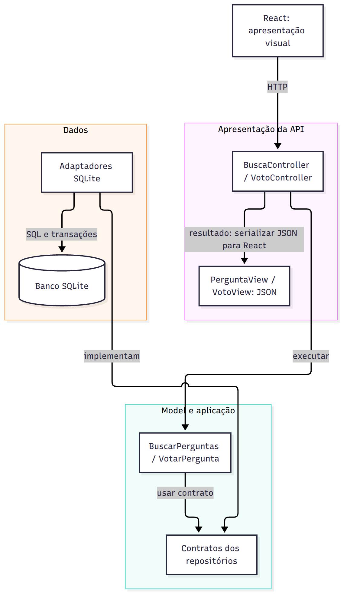

# Proposta de organização arquitetural

## Separação em camadas

| Camada | Responsabilidades | Módulos sugeridos |
|---|---|---|
| Apresentação/API | Ler parâmetros e sessão, chamar caso de uso, escolher status HTTP e serializar DTOs | BuscaController, VotoController, PerguntaView, VotoView |
| Negócio/aplicação | Validar termo e voto; coordenar consulta ou registro; aplicar regras de autorização | BuscarPerguntas, VotarPergunta |
| Dados | SQL, transações, projeções, restrições e acesso ao driver | PerguntasSqliteRepository, VotosSqliteRepository |
| Composição | Criar instâncias concretas, injetar contratos e registrar rotas | app.js/server.js |

Os controllers conhecem serviços; serviços conhecem contratos de repositório; implementações concretas são injetadas na composição. Repositórios não enviam HTTP, controllers não escrevem SQL e views não decidem regras de voto. A interface React continua sendo a apresentação visual, em aplicação separada.

## MVC para duas funcionalidades

### Busca (núcleo já implementado)

**Model:** serviço BuscarPerguntas e contrato do repositório de perguntas; acessa projeção de Pergunta com contagem de Resposta. **Controller:** lê `q`, chama o serviço, mapeia validação para 400 e falha interna para 500. **View:** representação JSON do array de perguntas. Na implementação pequena, res.json faz a serialização diretamente; extrair PerguntaView só é útil se o contrato de saída crescer.

Fluxo: GET `/perguntas/busca?q=java` → BuscaController → BuscarPerguntas → PerguntasSqliteRepository → SQLite → array de projeções → JSON 200 → React. Sem resultado, `[]`. Entrada inválida, 400. Erro de banco, 500 genérico.

### Votação (proposta, não implementada)

**Model:** Voto com usuário, pergunta e valor; serviço VotarPergunta coordena a operação. **Controller:** obtém usuário autenticado do middleware, valida parâmetros de transporte e chama o serviço. **View:** VotoView retorna `{id_pergunta, meu_voto, saldo}`. O saldo vem da mesma operação transacional, nunca de soma local não confirmada no frontend.

Fluxo: PUT `/perguntas/42/voto` com `{valor: 1}` → middleware de sessão → VotoController → VotarPergunta → contrato RepositorioVotos → transação de upsert/contagem → VotoView → JSON 200. Sem autenticação, 401; voto inválido, 400; pergunta inexistente, 404. Repetir o voto mantém o estado. A criação da tabela exige unicidade composta, CHECK(valor IN (-1,1)) e integridade referencial.

## Views no backend

Neste contexto, “View” é a representação JSON, conforme solicitado no enunciado, e não uma página HTML renderizada no servidor. A visão visual permanece no React. A divisão MVC não deve obrigar um arquivo por objeto minúsculo; funções de serialização são suficientes.

## Migração incremental e dependências

1. Manter contratos existentes e introduzir a busca em módulos separados, como entregue.
2. Criar autenticação e autoria real antes de votação, edição de tags e perfis.
3. Migrar SQL das rotas legadas para repositórios, com testes de regressão.
4. Adicionar tags e votos por migrações versionadas; não apagar dados para mudar o esquema.
5. Implementar notificações com Observer, adotando outbox apenas se houver requisito de entrega durável.

Não há justificativa atual para microsserviços. Um monólito modular reduz custo operacional e permite separar responsabilidades sem distribuir transações pela rede.
